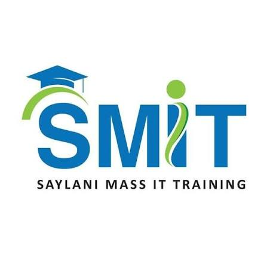
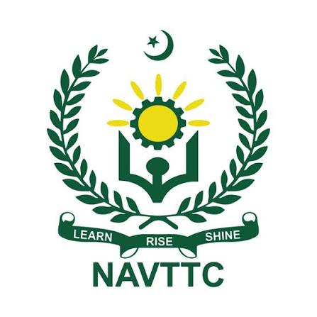

  

<h1 align="center">
  
</h1>

  
  
  
  

  

---

<table align="center" border="0" style="border: none; background: transparent;">
  <tr style="border: none; background: transparent;">
    <td width="60%" style="border: none; background: transparent;">
      <h2>🔥 About Me</h2>
      

        I am a high-impact <b>Full Stack Engineer</b>, <b>Enterprise SaaS Architect</b>, and <b>Tech Lead</b>. With a comprehensive background spanning high-performance production engineering, corporate technical consulting, and international tech education, I am dedicated to transforming complex business requirements into scalable, reliable software.
      

      

        I specialize in <b>architecting scalable database environments</b>, writing <b>performance-optimized enterprise engines</b>, and designing <b>secure application layers</b>. I am strongly committed to data integrity, custom microservice architecture, and logic-driven software workflows that do not lean on AI shortcuts.
      

      <ul>
        <li>🏢 <b>Founder & CEO</b> at <a href="https://tech4edges.com/">Tech4Edges</a></li>
        <li>🌍 <b>Community Leader:</b> Managing an active network of <b>13k+</b> technology professionals and students.</li>
        <li>🏆 <b>Honors:</b> LinkedIn Top Voice (Top Web Development Badge).</li>
      </ul>
    </td>
    <td width="40%" align="center" style="border: none; background: transparent;">
      
    </td>
  </tr>
</table>

---

<h2 align="center">⚡ Arsenal & Technologies</h2>

  <a href="https://skillicons.dev">
      
    
  </a>

  
| Domain | Technologies |
|:---:|:---|
| 🎨 **Frontend** | React.js, Next.js, Redux Toolkit, Tailwind CSS, Bootstrap, HTML5, CSS3, DOM Manipulation |
| 🛠️ **Backend** | Node.js, Express.js, PHP, RESTful APIs, Microservices, MVC Architecture |
| 🗄️ **Database** | MongoDB (Mongoose), MySQL (Relational Modeling, Complex Queries), Firebase (Firestore, Realtime DB) |
| ☁️ **DevOps & Infra** | Git, Docker, Vercel, SaaS Architecture, Webhooks Integration, Cloud Hosting |
| 🔒 **Security** | JWT, RBAC, Stripe Webhooks Validation, Multi-factor/OTP Security Layers |

---

<h2 align="center">💼 Professional Journey & Leadership</h2>

<i>Transforming engineering practices and scaling technical education worldwide.</i>

 

<table align="center" style="border-collapse: separate; border-spacing: 20px;">
  <tr>
    <td align="center" width="50%" valign="top">
       
      <h3>Tech4Edges</h3>
      
<b>Founder & CEO</b>  <i>(Nov 2025 – Present)</i>

      
Architecting custom enterprise-level software systems, business automation matrices, and multi-tenant SaaS products for regional and global clients. Directing engineering pipelines for optimal codebase security and microservice stability.

    </td>
    <td align="center" width="50%" valign="top">
       
      <h3>S.M.I.T (Saylani Mass I.T)</h3>
      
<b>Full Stack Master Trainer</b>  <i>(Jan 2024 – Present)</i>

      
Training, grading, and evaluating massive cohorts of student developers over 1.4-year intensive development modules. Directing hands-on instructions in the complete MERN Stack, logic breakdown, and testing protocols.

    </td>
  </tr>
  <tr>
    <td align="center" valign="top">
       
      <h3>NAVTTC</h3>
      
<b>Advance Web Development Trainer</b>  <i>(Sep 2025 – Nov 2025)</i>

      
Delivering technical acceleration programs under the federal vocational training model to enhance tech job placements, focusing on advanced web architecture.

    </td>
    <td align="center" valign="top">
       
      <h3>Arfa Karim Technology Incubator</h3>
      
<b>Full Stack PHP Trainer</b>  <i>(Jul 2025 – Present)</i>

      
Instructing early-stage tech founders and programmers in secure enterprise backends using custom PHP and relational MySQL systems.

    </td>
  </tr>
</table>

### 🌟 Additional Roles & Impact

- 🎓 **International Educator** at **Arizona State University (ASU)** (Remote Track) – Instructing global technical cohorts in fundamental and cutting-edge web technologies and server deployment strategies.
- 👨‍🏫 **Lecturer** at **University of Peshawar** (Sep 2025 – Present) – Teaching formal computing concepts, algorithmic workflows, and advanced programming tracks.
- 🚀 **Managing Director** at **Peaks & Plans** (Jun 2025 – Present) – Supervising operational layout, technological strategy, and development workflows.
- 💻 **Advance Web Development Trainer** at **EncoderBytes Pvt Ltd** (Sep 2025 – Present) – Leading accelerated training tracks focused on scaling production software architectures.
- 👨‍⚕️ **Visiting Lecturer** at **Institute of Health Sciences (IHS)** (Aug 2025 – Apr 2026) – Taught specialized medical informatics systems.
- ⚙️ **Full Stack Engineer** at **AJ Trust** (Jan 2024 – Present) – Maintaining and designing structural web environments and complex databases.
- 🎨 **Graphic Web Specialist** at **Daastan Club** & **Head of Media & Communications** at **CSSC-UOP**.

---

<h2 align="center">🛠️ Production-Grade Masterpieces</h2>

| Project | Highlights |
|:---|:---|
| 🎓 **Coursely** | A complex, scalable educational platform running on modern JavaScript technologies. Includes layered credential verification, a flexible admin panel, dynamic assignment collection, and multi-user type tracking. |
| 💳 **Installment Management Engine** | Enterprise-tier operational app featuring strict real-time financial tracking, automated ledger entry generation, client profiling tables, and secure administrative monitoring modules. |
| 🚚 **Courier & Logistics Fleet Platform** | Full-scale transit orchestration software designed with step-by-step route-tracking matrices, live manifest reporting pipelines, and internal employee role assignment layers. |
| 🏫 **Student ERP Matrix** | Comprehensive university-scale network executing digital student life-cycle records, grading charts, secure authentication gates, and low-latency database queries. |
| 🔍 **Tutor Finder Marketplace Engine** | Real-time multi-tenant marketplace platform utilizing advanced search filters, schedule booking configurations, instant customer communications, and dual-review validation setups. |
| 🏢 **IHS Visitor Management Setup** | Tailored localized validation system tracking arrivals, campus permissions, and secure visual verification logs. |

---

<h2 align="center">🎓 Education</h2>

- **Bachelor's Degree in Computer Science** — *University of Peshawar* (Oct 2020 - Nov 2024)

---

<h2 align="center">📈 GitHub Analytics</h2>

  
  

  

---

  

